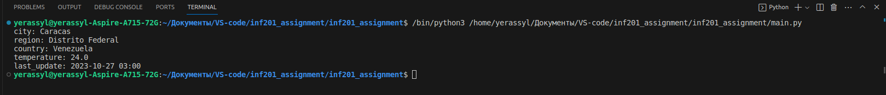

# inf201_assignment
как все работает ?
у нас есть три класса,weather который связывается с апи для получение об погоде в конкретном городе,gpt для получение рандомного города,
adapter который связывает классы для получение общего ouput. 

что нужно чтобы запустить app?
1)заклонить мой репозиторий к себе на локалку
2)создайте .env файл и создайте там два переменных
3) задайте туда api key который я скинул вам на почту или в телеграм скорее всего в телеграмм (-_-) как ниже на скриншоте:

4)теперь просто запустите main.py и вы увидете результат как здесь:

